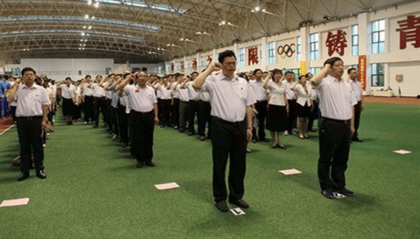

# 目录
* js效果
	* [轮播图（带分页器）](#轮播图带分页器)
	* [轮播图（带前进后退按钮）](#轮播图带前进后退按钮)
	* [栏目切换](#栏目切换)
	* [滚屏](#滚屏)
	* [文字向上滚动](#文字向上滚动)
	* [瀑布流](#瀑布流)
	* [移动的悬浮窗](#移动的悬浮窗)
	* [jsjQuery获取网页或元素的位置](#jsjQuery获取网页或元素的位置)
* 模板设参
	* [首页基本设参](#首页基本设参)
	* [文章页设参](#文章页设参)
# 轮播图（带分页器）
## html
```html   
	<link rel="stylesheet" href="images/swiper.min.css">
	<script type="text/javascript" src="http://libs.baidu.com/jquery/1.9.1/jquery.min.js"></script>
	<div class="swiper-container my-swiper">
		<ul class="swiper-wrapper">
			<li class="swiper-slide swiper-item"><a href="#"><span>第一张图的简要</span></a></li>
			<li class="swiper-slide swiper-item"><a href="#"><span>第二张图的简要</span></a></li>
		</ul>
		<!-- 如果需要分页器 -->
		<div class="swiper-pagination my-pagination"></div>
	</div>
	<script src="images/swiper.min.js"></script>
```
## css
```css
	.my-swiper {
		width: 400px;
		height: 200px;
		margin: 20px auto;
	}
	.my-swiper ul {
		padding: 0;
		margin: 0;
	}
	.swiper-item a {
		display: inline-block;
		width: 100%;
		height: 100%;
		overflow: hidden;
		position: relative;
	}
	.swiper-item a img {
		width: 100%;
		height: 100%;
	}
	.swiper-item a span {
		box-sizing: border-box;
		position: absolute;
		bottom: 0;
		left: 0;
		display: inline-block;
		width: 100%;
		height: 50px;
		line-height: 50px;
		color: #fff;
		font-size: 13px;
		padding-left: 20px;
		background: #000; 
		opacity: 0.5;
	}
	.my-pagination {
		box-sizing: border-box;
		text-align: right;
		padding-right: 13px;
		bottom: 13px !important;
	}
	.my-pagination .swiper-pagination-bullet {
		width: 22px;
		height: 22px;
		line-height: 22px;
		text-align: center;
		margin-right: 4px;
		font-size: 13px;
		color: #fff;
		background: #7f7969;
		opacity: 1;
	}
	.my-pagination .swiper-pagination-bullet-active {
			background: #fa8d00;
	}
```
## javascript
```javascript
	$(document).ready(function() {
		var mySwiper = new Swiper(".my-swiper", {
			autoplay: { // 是否自动切换
				disableOnInteraction: false, // 操作swiper后自动切换不会停止，每次都会重新启动swiper，操作包括触碰、拖动、点击pagination等。
			},
			speed: 300, // 切换速度
			loop: true, // 循环切换
				
			// 分页器
			pagination: {
				el: ".my-pagination",
				clickable: true,
				renderBullet: function (index, className) {
					return "<span class='" + className + "'>" + (index + 1) + "</span>";
				},
			},
		});
		// 鼠标移上停止切换
		mySwiper.el.onmouseover = function () {
			mySwiper.autoplay.stop();
		}
		// 鼠标移开开始切换
		mySwiper.el.onmouseleave = function () {
			mySwiper.autoplay.start();
		}
	});
```
效果：  

# 轮播图（带前进后退按钮）
## html
```html
	<link rel="stylesheet" type="text/css" href="images/swiper.min.css" />
	<div class="content">
		<div class="swiper-container my-swiper">
			<ul class="swiper-wrapper">
				<li class="swiper-slide swiper-item"><a href="#"></a></li>
				<li class="swiper-slide swiper-item"><a href="#"></a></li>
				<li class="swiper-slide swiper-item"><a href="#"></a></li>
				<li class="swiper-slide swiper-item"><a href="#"></a></li>
			</ul>
		</div>
		<!-- 如果需要导航按钮 -->
		<div class="swiper-button-prev swiper-btn"></div>
		<div class="swiper-button-next swiper-btn"></div>
	</div>
	<script type="text/javascript" src="images/swiper.min.js"></script>
```
## css
```css
	.content {
		position: relative;
		width: 1110px;
		height: 67px;
		padding: 0 32px;
		box-sizing: border-box;
		margin: 20px auto;
	}
	.my-swiper {
		height: 100%;
		margin-left: 12px;
	}
	.my-swiper ul {
		margin: 0;
		padding: 0;
		list-style: none;
	}
	.swiper-item {
		width: 241px;
		margin-right: 16px;
	}
	.swiper-item a {
		display: inline-block;
		width:100%;
		height: 100%;
		overflow: hidden;
	}
	.swiper-item a img {
		width: 100%;
		height: 100%;
	}
	.swiper-btn {
		top: 0;
		margin-top: 0;
		width: 32px;
		height: 67px;
	}
	.content .swiper-button-prev {
		left: 0;
		background: #9d9d9d url(images/shouye_bg_0.png) no-repeat 7px 17px;
	}
	.content .swiper-button-next {
		right: 0;
		background: #9d9d9d url(images/shouye_bg_1.png) no-repeat 7px 17px;
	}
```
## javascript
```javascript
	$(document).ready(function() {
		var mySwiper = new Swiper(".my-swiper", {
			autoplay: { // 是否自动切换
				disableOnInteraction: false, // 操作swiper后自动切换不会停止，每次都会重新启动swiper，操作包括触碰、拖动、点击pagination等。
			},
			speed: 300, // 切换速度
			loop: true, // 循环切换
			slidesPerView: "auto", // 设置slider容器能够同时显示的slides数量.可以设置为数字（可为小数，小数不可loop），或者 'auto'则自动根据slides的宽度来设定数量。
			navigation: {
				nextEl: '.swiper-button-next',
				prevEl: '.swiper-button-prev',
			},
		});
	});
```
效果：  

# 栏目切换
## html
```html
	<div class="news-container">
		<ul class="cf list-head">
			<li class="fl news-item item-active"><a href="#">政务要闻</a></li>
			<li class="fl news-item"><a href="#">各镇动态</a></li>
			<li class="fl news-item"><a href="#">部门信息</a></li>
			<li class="fl news-item"><a href="#">媒体聚焦</a></li>
			<li class="fl news-item"><a href="#">视频新闻</a></li>
		</ul>
		<ul class="news-list">
			<li><a href="#">我县召开扶贫对象动态调整和建档立卡信息采集工.. </a><span>11-16</span></li>
		</ul>
		<ul class="hide news-list">
			<li><a href="#">我县召开扶贫对象动态调整和建档立卡信息采集工1.. </a><span>11-16</span></li>
		</ul>
		<ul class="hide news-list">
			<li><a href="#">我县召开扶贫对象动态调整和建档立卡信息采集工2.. </a><span>11-16</span></li>
		</ul>
		<ul class="hide news-list">
			<li><a href="#">我县召开扶贫对象动态调整和建档立卡信息采集工3.. </a><span>11-16</span></li>
		</ul>
		<ul class="hide news-list">
			<li><a href="#">我县召开扶贫对象动态调整和建档立卡信息采集工4.. </a><span>11-16</span></li>
		</ul>
	</div>
```
## css
```css
	.cf:after {
		display: block;
		content: "";
		height: 0;
		visibility: hidden;
		clear: both;
	}
	.cf {
		zoom: 1;
	}
	.fl {
		float: left;
	}
	.hide {
		display: none;
	}
	ul {
		padding: 0;
		margin: 0;
	}
	a {
		text-decoration: none; 
	}
	.news-container {
		width: 500px;
		height: 340px;
		overflow: hidden;
		border: 1px solid #ccc;
		margin: 20px auto;
	}
	.list-head {
		box-sizing: border-box;
		border-bottom: 1px solid #ccc;
		list-style: none;
		height: 35px;
	}
	.news-item {
		box-sizing: border-box;
		padding: 0 10px;
		height: 35px;
		line-height: 35px;
		font-size: 17px;
		color: #333;
		width: 20%;
		text-align: center;
	}
	.item-active {
		border-bottom: 1px solid #125aae;
		color: #1a5fb0;
	}
	.news-item a {
		display: inline-block;
		width: 100%;
		height: 100%;
		color: inherit;
	}
	.news-list li {
		height: 43px;
		line-height:43px;
		border-bottom: 1px solid #bfbfbf;
		padding-left: 30px;
		background: url(shouye_icon_2.png) no-repeat 14px 20px;
		font-size: 15px;
		color: #333;
		list-style: none;
	}
	.news-list li a {
		color: inherit;
	}
	.news-list li span {
		float: right;
		font-size: 13px;
		color: #999;
	}
```
## javascript
```javascript
	$(document).ready(function() {
		switchNav(".news-item", "item-active", "news-list");
	});
	/**
	* 栏目导航切换
	* @param item // 鼠标滑过的项
	* @param active // 当前的项
	* @param list // 要显示的项
	*/
	function switchNav(item, active, list) {
		$(item).mouseover(function() {
			$(this).addClass(active).siblings(item).removeClass(active);
			var index = $(this).index(item);
			$(list).eq(index).removeClass("hide").siblings(list).addClass("hide");
		});
	}
```
# 滚屏
## html
```html
	<div class="page_0"></div>
	<div class="page_1"></div>
	<div class="page_2"></div>
	<div class="page_3"></div>
```
## css
```css
	html, body { height: 100%; }
	body { margin: 0; }
	div { height: 100%; }
	.page_0 { background: #fee; }
	.page_1 { background: #efe; }
	.page_2 { background: #eef; }
	.page_3 { background: red; }
```
## javascript
```javascript
	document.addEventListener("DOMContentLoaded", function() {
		var body = document.body;
		var html = document.documentElement;
		var itv;
		var height = document.body.offsetHeight;
		var page = scrollTop() / height | 0;
		// 窗口大小改变事件
		addEventListener("resize", onresize, false);
		onresize();
		// 滚轮事件
		document.body.addEventListener("onwheel" in document ? "wheel" : "mousewheel", function(e) {
			// console.log(e);
			clearTimeout(itv);
			itv = setTimeout(function() {
				var delta = e.wheelDelta / 120 || -e.deltaY / 3;
				page -= delta;
				var max = (document.body.scrollHeight / height | 0) - 1;
				if (page < 0) return page = 0;
				if (page > max) return page = max; 
				move();
			}, 100);
			e.preventDefault();
		});
		// 平滑滚动
		function move() {
			var value = height * page;
			var diff = scrollTop() - value;
			(function callee() {
				diff = diff / 1.2 | 0;
				scrollTop(value + diff);
				if (diff) itv = setTimeout(callee, 16);
			})();
		}
		// resize事件
		function onresize() {
			height = body.offsetHeight;
			move();
		};
		// 获取或设置scrollTop
		function scrollTop(v) {
			if (v == null) return Math.max(body.scrollTop, html.scrollTop);
			else body.scrollTop = html.scrollTop = v;
		}
	});
```
# 文字向上滚动
## html
```html
	<div id="scrollBox">
		<ul id="con1">
			<li>我是测试内容0！！<li>
			<li>我是测试内容1！！<li>
			<li>我是测试内容2！！<li>
			<li>我是测试内容3！！<li>
			<li>我是测试内容4！！<li>
			<li>我是测试内容5！！<li>
			<li>我是测试内容6！！<li>
			<li>我是测试内容7！！<li>
			<li>我是测试内容8！！<li>
			<li>我是测试内容9！！<li>
		</ul>
		<ul id="con2"></ul>
	</div>
```
## css
```css
	* { 
		margin: 0; 
		padding: 0; 
	}
	ul, li { list-style: none; }
	#scrollBox { 
		height: 150px;
		width: 300px;
		margin: 100px auto;
		background: #f09; 
		overflow: hidden;
	}
	#con1, #con2 { 
		width: 280px; 
		float: left;
	}
	#scrollBox li {
		height: 15px;
		line-height: 15px;
		text-align: center;
	}
```
## javascript
```javascript
	var area = document.getElementById("scrollBox");
	var con1 = document.getElementById("con1");
	var con2 = document.getElementById("con2");
	con2.innerHTML = con1.innerHTML;
	function scrollUp() {
		if (area.scrollTop >= con1.offsetHeight) {
			area.scrollTop = 0;
		} else {
			area.scrollTop++;
		}
	}
	var myTimer = setInterval(scrollUp, 50);
	area.onmouseover = function() {
		clearInterval(myTimer);
	}
	area.onmouseout = function() {
		myTimer = setInterval(scrollUp, 50);
	}
```
# 瀑布流
## html
```html
	<div id="container">
		<div class="img-item">
			<div class="img"></div>
		</div>
		...
	</div>
```
## css
```css
	body { background: #efefef; }
	img {
		width: 175px; 
		height: auto;
	}
	#container { 
		position: relative;
		margin: 0 auto;
	}
	.img-item {
		box-sizing: border-box;
		padding: 10px 0 0 10px;
		float: left;
	}
	.img {
		box-sizing: border-box;
		padding: 10px;
		border: 1px solid #e7e4e4;
		background: #fff;
		border-radius: 4px;
		box-shadow: 0 0 2px #838181;
	}
```
## javascript
```javascript
	window.onload = function() {
		waterfall("container", "img-item");
	}
	window.onresize = function() {
		waterfall("container", "img-item");
	}
	window.onscroll = function() {
		// 页面总高度
		var bodyH = document.documentElement.scrollHeight;
		var scrollH = document.documentElement.scrollTop;
		var screenH = document.documentElement.clientHeight;
		// 随机生成一张图片
		if (bodyH <= scrollH + screenH) {
			var container = document.getElementById("container")
			var containerW = container.clientWidth;
			var itemW = document.getElementsByClassName("img-item")[0].offsetWidth;
			var cols = Math.floor(containerW / itemW);
			for (var i = 0; i <= cols; i++) {
				var num = Math.floor(Math.random() * 19);
				var imgItem = document.createElement("div");
				imgItem.className = "img-item";
				imgItem.innerHTML = "<div class='img'></div>";
				container.appendChild(imgItem);
			}
			waterfall("container", "img-item");
		}
	}
	/**
	* 瀑布流
	* @param container // 瀑布流容器
	* @param imgItem // 图片容器
	*/
	function waterfall(container, imgItem) {
		// 获得整个容器元素及其宽度
		var container = document.getElementById(container);
		var containerW = container.clientWidth;
		// 获得每个图片容器及其宽度
		// clientWidth不包括border和margin，offsetWisth包括border和margin
		var items = container.getElementsByClassName(imgItem);
		var itemW = items[0].offsetWidth;
		// 一行的列数
		var cols = Math.floor(containerW / itemW);
		// 设置整个容器的宽度
		container.style.width = cols * itemW + "px";
		// 第一列高度的集合
		var firstColHs = [];
		for (var i = 0; i < items.length; i++) {
			if (i < cols) {
				firstColHs.push(items[i].offsetHeight);
			} else {
				var minH = Math.min.apply(null, firstColHs);
				var minIndex = getMinIndex(firstColHs, minH);
				items[i].style.position = "absolute";
				items[i].style.top = minH + "px";
				items[i].style.left = itemW * minIndex + "px";
				firstColHs[minIndex] += items[i].offsetHeight;
			}
		}
	}
	/** 
		* 获得第一排最小高度的索引
		* @param arr 
		* @param num
		*/ 
	function getMinIndex(arr, num) {
		for (var i in arr) {
			if (arr[i] == num) {
				return i;
			}
		}
	}
```
# 移动的悬浮窗
## html
```html
	<div id="suspen">
		<div class="suspen-text">这是一个随时移动的悬浮窗</div>
		<div class="suspen-close">关闭</div>
	</div>
```
## css
```css
	* { 
		margin: 0;
		padding: 0;
	}
	#suspen {
		position: fixed;
		top: 50%;
		left: 20%;
		width: 280px;
		height: 100px;
		cursor: pointer;
	}
	.suspen-text {
		font-size: 16px;
		color: #fff;
		text-align: center;
		background: #4c67a7;
		width: 100%;
		height: 100%;
		border-radius: 4px;
	}
	.suspen-close {
		font-size: 14px;
		color: #000;
		position: absolute;
		top: -23px;
		right: 0;
		cursor: pointer;
	}
```
## javascript
```javascript
	var toBottom = true;
	var toRight = true;
	function move() {
		var clientH = $(window).height();
		var clientW = $(window).width();
		var suspenH = $("#suspen").height();
		var suspenW = $("#suspen").width();
		var suspenT = $("#suspen").offset().top;
		var suspenL = $("#suspen").offset().left;
		if (toBottom) {
			suspenT++;
		} else {
			suspenT--;
		}
		if (suspenT > clientH - suspenH) {
			suspenT = clientH - suspenH;
			toBottom = false;
		}
		if ( suspenT < 0) {
			suspenT = 0;
			toBottom = true;
		}
		if (toRight) {
			suspenL++;
		} else {
			suspenL--;
		}
		if (suspenL > clientW - suspenW) {
			suspenL = clientW - suspenW;
			toRight = false;
		}
		if (suspenL < 0) {
			suspenL = 0;
			toRight = true;
		}
		$("#suspen").css({
			"top": suspenT + "px",
			"left": suspenL + "px"
		})
	}
	var moveInter = setInterval(move, 16);
	$("#suspen").mouseover(function() {
		clearInterval(moveInter);
	})
	$("#suspen").mouseout(function() {
		moveInter = setInterval(move, 16);
	})
	$(".suspen-close").click(function(){
		$("#suspen").unbind().hide();
	})
```
# jsjQuery获取网页或元素的位置
```html
// JavaScript获取
1、 document.body.clientWidth ==> body对象的宽度
2、 document.body.clientHeight ==> body对象的高度
3、 document.documentElement.clientWidth ==> 可见区宽度
4、 document.documentElement.clientHeight ==> 可见区高度
 
5、 document.body.clientWidth ==> 网页可见区宽度
6、 document.body.clientHeight ==> 网页可见区高度
7、 document.body.offsetWidth ==> 网页可见区宽（包括边线的宽）
8、 document.body.offsetHeight ==> 网页可见区高（包括边线的高）
9、 document.body.scrollWidth ==> 网页正文全文宽
10、 document.body.scrollheight ==> 网页正文全文高
11、 document.body.scrollTop ==> 网页被卷去的高
12、 document.body.scrollLeft ==> 网页被卷去的左
13、 window.screenTop ==> 网页正文部分上
14、 window.screenLeft ==> 网页正文部分左
15、 window.screen.height ==> 屏幕分辨率的高
16、 window.screen.width ==> 屏幕分辨率的宽
17、 window.screen.availHeight ==> 屏幕可用工作区高度
18、 window.screen.availWidth ==> 屏幕可用工作区宽度

// jQuery获取
1、 $(window).height() ==> 浏览器窗口可视区高度
2、 $(window).width() ==> 浏览器窗口可视区宽度
3、 $(document).height() ==> 浏览器窗口文档高度
4、 $(document).width() ==> 浏览器窗口文档宽度
5、 $(document.body).height() ==> 浏览器窗口文档body高度
6、 $(document.body).width() ==> 浏览器窗口文档body宽度
7、 $(document.body).outerHeight(true) ==> 浏览器窗口文档body总高度，包括border padding margin
8、 $(document.body).outerWidth(true) ==> 浏览器窗口文档body总宽度，包括border padding margin

// HTML精确定位：scrollLeft，scrollWidth，clientWidth，offsetWidth
1、 scrollHeight：获取对象的滚动高度
2、 scrollWidth：获取对象的滚动宽度
3、 scrollLeft：设置或获取位于对象左边界和窗口中目前可见内容的最左端之间的距离
4、 scrollTop：设置或获取位于对象上边界和窗口中可见内容最顶端之间的距离
5、 offsetHeight：获取对象相对于版面或由offsetParent属性指定的父坐标的高度
6、 offsetLeft：获取对象相对于版面或由offsetParent属性指定的父坐标的左侧位置
7、 offsetTop：获取对象相对于版面或由offsetParent属性指定的父坐标的顶端位置
8、 event.clientX：相对于文档的水平坐标
9、 event.clientY：相对于文档的垂直坐标
10、 event.offsetX：相对于容器的水平坐标
11、 event.offsetY：相对于文档的垂直坐标
12、 document.documentElement.scrollTop：垂直方向滚动的值
```
# 首页基本设参
```html
	<!-- 大标题 -->
	<!--subfor-->
	<h1 class="s1-title"><a href='<!--articleurl-->' title='<!--articletitle-->' target='_blank'><!--articletitleshort--></a></h1>
	<p class="s1-p">[<!--articlebrief-->]</p>
	<!--/subfor-->

	<!-- 图片新闻 -->
	<!--subfor-->
	<li class="swiper-slide"><a href="<!--articleurl-->">"  alt=""><span><!--articletitleshort--></span></a></li>
	<!--/subfor-->

	<!-- 栏目（带链接） -->
	<!--for--><a href="<!--columnurl-->"><!--columnname--></a><!--/for-->

	<!-- 新闻列表 -->
	<!--subfor-->
	<li><a href="<!--articleurl-->" title='<!--articletitle-->' target='_blank'><!--articletitleshort--></a><span><!--month2-->-<!--day2--></span></li>
	<!--/subfor-->
```
# 文章页设参
```html
	<script language="javascript">function doZoom(size){document.getElementById('zoom').style.fontSize=size+'px';}</script>
	<!--subfor-->
	<h2 class="s2-title"><!--articlehtmltitle--></h2>
	<p class="s2-date"><span>发布日期：<!--year4-->-<!--month2-->-<!--day2--></span><span class="ml20">浏览次数：<!--articlehits-->次</span><span class="ml20">字体：【<a href='javascript:doZoom(16)'>大</a> <a href='javascript:doZoom(14)'>中</a> <a href='javascript:doZoom(12)'>小</a>】</span></p>
	<div class="s2-p" id="zoom"><!--articlecontent--></div>
	<!--if--><!--articleauthor--><p class="s2-edit">（编辑：<!--articleauthor-->）</p><!--/if-->
	<!--if--><!--articlesource--><p class="s2-edit">信息来源：<!--articlesource--></p><!--/if-->
	<div class="cf s2-share">分享到：
		<div class="bshare-custom icon-medium" style="display: inline-block;">
			<a class=bshare-qzone title=分享到QQ空间></a>
			<a class=bshare-sinaminiblog title=分享到新浪微博></a>
			<a class=bshare-renren title=分享到人人网></a>
			<a class=bshare-qqmb title=分享到腾讯微博></a>
			<a class=bshare-neteasemb title=分享到网易微博></a>
			<a class="bshare-more bshare-more-icon more-style-addthis" title=更多平台></a>
			<span class="BSHARE_COUNT bshare-share-count">0</span>
		</div>
		<script charset=utf-8 src="http://static.bshare.cn/b/buttonLite.js#style=-1&uuid=&pophcol=2&lang=zh"></script>
		<script charset=utf-8 src="http://static.bshare.cn/b/bshareC0.js"></script>
		<div class="fr s2-print">
			<a href="javascript:window.print()">【打印本页】</a>
			<a href="javascript:window.opener=null;window.open('','_self');window.close();">【关闭本页】</a>
		</div>
	</div>
	<!--if--><!--articleattach-->
	<p class="s2-download"><span class="down">[全文下载]</span><a href='<!--articleattach-->'>附件下载</a></p>
	<!--/if-->
	<p class="s2-prev"><!--articlepreviouslink--></p>
	<p class="s2-prev"><!--articlenextlink--></p>
	<!--/subfor-->
```


              
       
      
